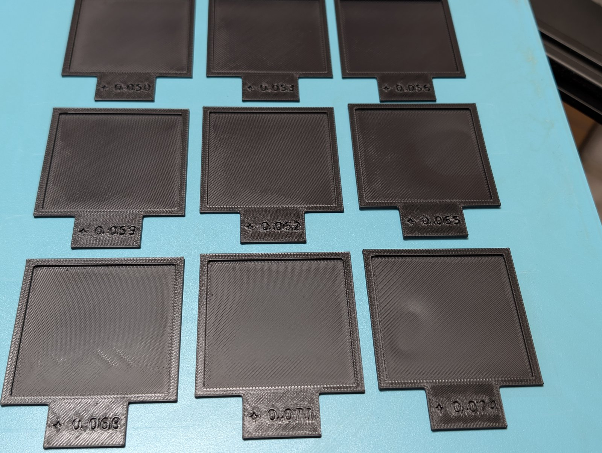

# Z-Offset Sweep

Print nine first-layer test patches in a single job, each at a **different Z
offset**, with its offset **engraved on the part**.

Instead of babystepping by hand and trying to remember what you set, the offset
is applied automatically per object, mid-print, from the sliced G-code. The
number on the part is the number the printer used — they come from one source
and cannot disagree.



*A finished sweep, +0.050 (back left) to +0.074 (front right) in 0.003 steps.
The gradient is visible without reading a single label: the back row's
extrusion lines have merged into a solid glossy surface, while by the front row
the individual lines are separated by visible gaps.*

## A real result

On an Elegoo Centauri Carbon with a load-cell probe, running OpenCentauri
COSMOS (Kalico), immediately after a full calibration:

- A coarse read suggested +0.040 was close but slightly tight.
- One 9-frame sweep, **+0.074 → +0.050 in 0.003 steps**, resolved it to
  **+0.056** — the first frame where the lines had fully merged without the
  surface starting to look over-pressed.
- Total cost: one 50-minute unattended print.

0.003 mm steps proved fine enough to distinguish adjacent frames by eye on this
machine, and 0.024 mm of total span was enough to cross the transition. Those
are reasonable starting numbers if you already know roughly where you are; open
the span up and coarsen the step if you don't.

## Why

The usual way to find a Z offset is to start a print, watch the first layer,
nudge the offset live, and remember which nudge produced the good result. That
works, but the record lives in your head. If you print a labelled test plate
instead, the label is only a *claim* about what the printer did — one mistimed
babystep and you have a physical object that lies to you, permanently.

This removes the gap. The offset is encoded in each object's filename. The
slicer carries that name into the G-code as an object marker. A post-processing
script reads the value back out of that marker and emits the matching
`SET_GCODE_OFFSET`. The engraving and the applied offset are the same number,
derived from the same place.

## How it works

```
FreeCAD Params sheet          z_start / z_end / n_frames
        │
        ├─ engraves the value on the tab   (ShapeString → pocket)
        └─ writes it into the filename     Z-Offset-Test-04-pos-0.065.stl
                   │
                   ▼
             slicer emits            EXCLUDE_OBJECT_START NAME=...pos-0.065...
                   │
                   ▼
        post-processing script inserts
              SET_GCODE_OFFSET Z=0.065 MOVE=1 MOVE_SPEED=5
```

Because the slicer re-emits object markers on every layer, the offset
re-asserts itself per frame per layer. It is self-correcting: a missed
injection is fixed by the next one.

## Requirements

- **Klipper or Kalico.** `SET_GCODE_OFFSET` with `Z_ADJUST`/`MOVE` is a core
  `gcode_move` command. Marlin's `M290` is *not* equivalent and this will not
  work as-is on Marlin.
- **A slicer that labels objects.** OrcaSlicer, PrusaSlicer and SuperSlicer all
  emit `EXCLUDE_OBJECT_START NAME=`. In Orca the setting is
  *Print Settings → Others → Exclude objects*.
- **FreeCAD 1.1+** if you want to change the range. If the bundled STLs suit
  you, you don't need FreeCAD at all.

Tested on an Elegoo Centauri Carbon running OpenCentauri COSMOS (Kalico), and
on the stock Elegoo firmware, whose C++ Klipper reimplementation also
implements `SET_GCODE_OFFSET` faithfully.

## Use

### 1. Generate the frames (optional)

Open `cad/z-offset-test-tab.FCStd`, set the sweep in the **Params** sheet:

| alias | meaning |
|---|---|
| `z_start` | first offset |
| `z_end` | last offset — may be *below* `z_start` for a descending sweep |
| `n_frames` | how many frames |
| `z_decimals` | decimal places in label and filename |
| `grid_cols` | frames per row |
| `grid_gap` | gap between frames, mm |
| `out_dir` | optional output path; defaults to `stl/` beside the .FCStd |

Run `macro/ZOffsetSweep.FCMacro`. It writes one STL per frame, each already
positioned at its own spot in the grid, and reports the derived step:

```
Z-offset sweep: 9 frames, +0.074 -> +0.050, step 0.003 (descending)
grid: 3 x 3 at 62.0 x 76.5 mm pitch (footprint 180.0 x 223.5 mm)
```

Check that step against what you intended — a wrong `n_frames` silently
produces a different step, and the labels would be perfectly consistent with
the sweep you didn't want.

### 2. Slice

Import all the STLs **as separate objects**, not merged into one. Merging them
gives you a single object with one name, and the post-processor has nothing to
key on.

Each STL carries its own grid position, but be aware that **most slicers
discard it**: OrcaSlicer auto-arranges on import (Preferences → `auto_arrange`)
and will stack or re-pack them regardless. In practice you will probably
separate and arrange them by hand.

Arrange them in **index order** — `01` at back-left, reading left-to-right then
forward. That is what the two-digit filename prefix is for: the files sort into
sweep order, so you can lay them out without cross-referencing values. A sorted
plate lets you see the transition at a glance; a scrambled one means reading
nine labels and sorting them mentally. Either works — the engraving is
authoritative — but only one of them is quick.

Enable **Exclude objects**, and add the post-processor under
*Print Settings → Others → Post-processing Scripts*:

```
/usr/bin/python3 /path/to/zoffset-sweep-postprocess.py;
```

### 3. Verify before printing

```
grep -c zoffset-sweep sliced.gcode      # expect frames × layers, + 1 reset
```

This check matters — see *Silent failure* below.

### 4. Print and read

The whole diagnostic is in **layer 1**. Later layers only build the frame wall
and the tab. Note the engraving is a pocket in the *top* of the tab, so it does
not finish forming until the last layer — cancel early and you get unlabelled
patches.

## Things that will bite you

### `MOVE=1` is mandatory

```gcode
SET_GCODE_OFFSET Z=0.065 MOVE=1 MOVE_SPEED=5
```

Without `MOVE=1`, the command only updates `base_position`. The toolhead does
not physically move until the next command carrying a `Z` word — and mid-layer,
every extrusion move is X/Y/E only. So all frames would print at the same
height and the offsets would first take effect at the *next layer change*.

The result looks like a successful print of correctly labelled frames that all
have identical first layers. `MOVE=1` forces the corrective move at the moment
of injection, during the travel between objects.

### Silent failure: wrong process preset

The post-processing script is attached to a **process/print preset**. If you
change presets — and selecting a filament can drag you onto a different one —
the script is silently not invoked. There is no error, because nothing ran.

You get nine identically-printed frames wearing nine different engraved
numbers: the exact failure this design exists to prevent, slipping in one layer
below where the naming protects you. The script raises loudly if it runs and
finds no matching objects, but it cannot raise if it never runs. Hence the
`grep` check above.

### The offset survives a cancelled print

The reset to `Z=0` is the last line of the file. Cancel mid-print and the last
applied offset stays active, quietly biasing whatever you print next. Klipper's
`CANCEL_PRINT` does not clear `gcode_offset`. After any cancelled sweep:

```gcode
SET_GCODE_OFFSET Z=0 MOVE=0
```

Worth adding to your own `PRINT_END`/`CANCEL_PRINT` override.

### Absolute vs relative

This script emits absolute `Z=`, which overwrites any offset already applied —
including one your start G-code may have set. That is deliberate: it makes each
frame's value mean the same thing regardless of print order. If your firmware
applies a calibrated Z offset as a live `gcode_offset` rather than baking it
into the endstop, use `Z_ADJUST=` instead so the sweep rides on top of it.

## Layout

```
cad/          FreeCAD parametric source
macro/        generator macro (FreeCAD)
postprocess/  slicer post-processing script
stl/          example sweep, +0.074 → +0.050 in 0.003 steps
```

## Licence

Dual-licensed by component:

- **Code** — `macro/`, `postprocess/` — MIT. See `LICENSE-MIT`.
- **Model** — `cad/`, `stl/` — CC BY-SA 4.0. See `LICENSE-CC-BY-SA-4.0`.

© 2026 John Crockett
